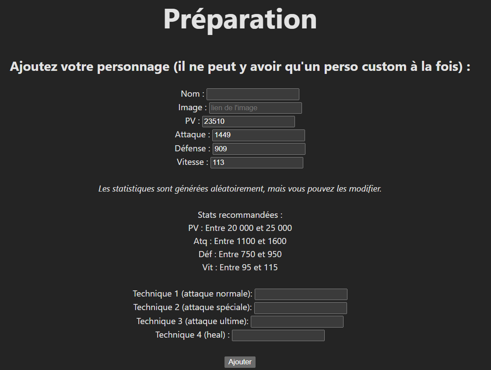
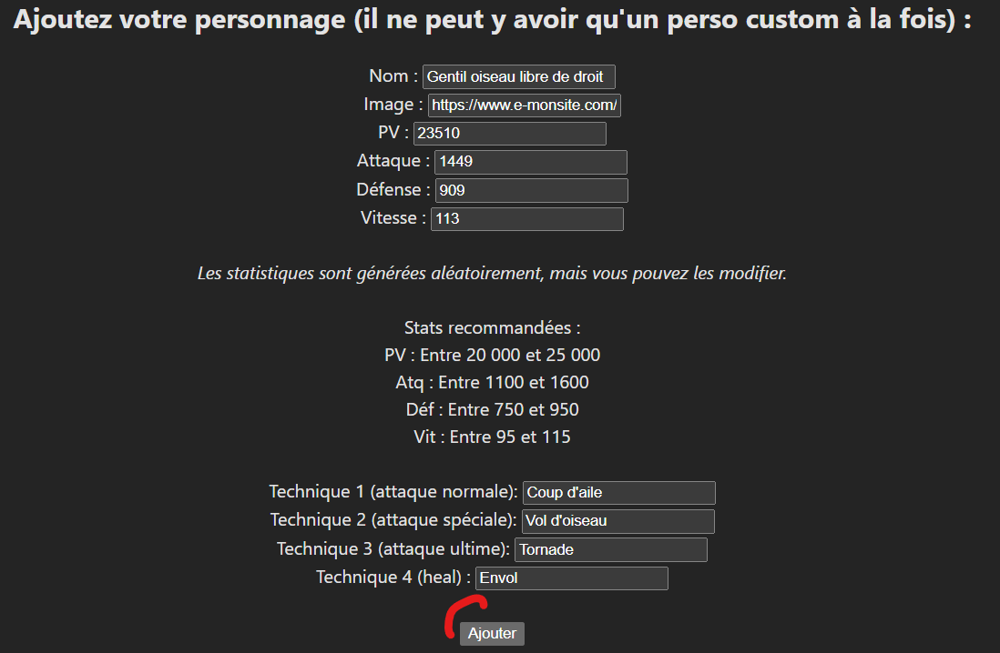
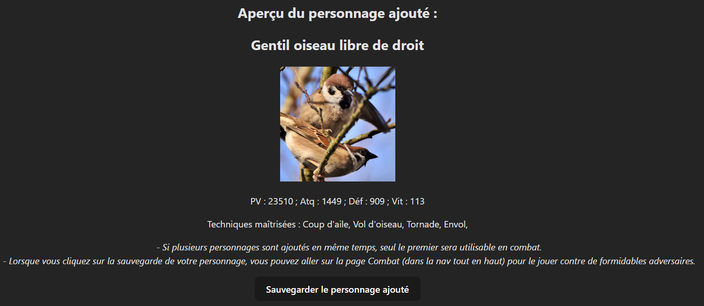
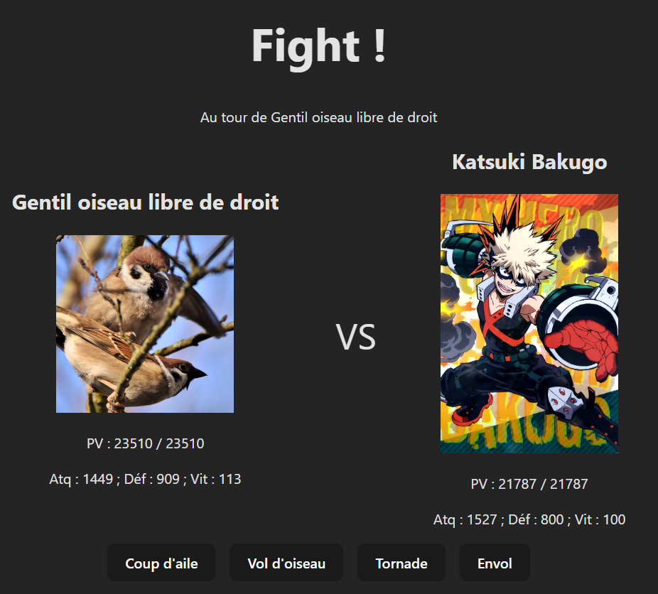

# Pour commencer

# 1. Installez les dépendances
```
npm install
```

# 2. Lancez le serveur de développement
```
npm run dev
```
Ensuite, ouvrez votre navigateur au lien indiqué.

Vous aurez ensuite une page indiquant 2 chemins d'accès :
Préparation, et Combat.

# 3. Préparation

Rendez-vous d'abord sur la page de préparation.
Vous aurez la possibilité de créer un personnage selon les instructions données.



Pour obtenir le lien d'une image, il est possible de copier l'adresse du lien d'une image sur Google Images par exemple.

_Notez que les noms de techniques sont purement cosmétiques et n'ont pas d'impact sur le combat._

Lorsque vous avez fini de créer votre personnage, cliquez sur le bouton ajouter :



Un aperçu de votre personnage sera affiché. Il ne reste plus qu'à le sauvegarder en cliquant sur le bouton de sauvegarde.



Enfin, il est temps de se rendre sur la page combat depuis la nav en haut de la page.

# 4. Combat

Rendez-vous ensuite sur la page de combat.

Vous jouerez le personnage que vous avez créé contre un ennemi aux stats prédéfinies lors d'un combat au tour par tour.

Il sera possible de choisir l'une des 4 attaques disponibles dont vous aurez défini les noms.



Bon combat !

## Détails des attaques disponibles pour le joueur

Technique 1 (attaque normale) : (Atq du personnage - Def de l'ennemi) x Chances de coup critique

Technique 2 (attaque spéciale) : (Atq du personnage x 1.5 - Def de l'ennemi) x Chances de coup critique

Technique 3 (ultime) : Ignore la défense. Atq du personnage x 3 x Chances de coup critique

Technique 4 (soin) : Soigne une valeur aléatoire entre 10% et 25% des PV Max.

Chances de coup critique = 10%. Quand les 10% de chances sont atteints, le coup critique est déclenché, et l'attaque fait le double de dégâts.

## Détails des ennemis

Au début du combat. L'un des deux ennemis contre lequel votre personnage sera confronté est choisi au hasard parmi les deux ci-dessous.

### Izuku Midoriya

PV : 23989 ; Atq : 1287 ; Déf : 923 ; Vit : 108

Attaques :
- Revêtement intégral : Soigne entre 5% et 10% des PV max.
- Delaware smash : (Atq de l'ennemi - Def du joueur) x chances de coup critique
- Detroit smash : (Atq de l'ennemi x 1.75 - Def du joueur) x chances de coup critique
- Texas smash : Atq de l'ennemi x 3 - Def du joueur. Ne peut pas être un critique.

### Katsuki Bakugo

PV : 21787 ; Atq : 1527 ; Déf : 800 ; Vit : 100

Attaques :
- Flashbang : L'ennemi attaque avec une attaque spéciale empêchant le joueur d'agir au prochain tour. (Attaque de l'ennemi x 0.8 - Def du joueur) x chances de coup critique
- Howitzer Impact : (Attaque de l'ennemi x 3 - Def du joueur) x chances de coup critique
- Mitrailleuse Anti-Blindage : Ignore la Défense. Attaque de l'ennemi x 1.5 x chances de coup critique
- Exploite-A-Puit : Rend des PV à hauteur de 50% des dégâts infligés. Exemple : si l'ennemi inflige 1000 de dégâts, il reçoit un soin de 500 PV.<br>
(Attaque de l'ennemi x 2 - Def du joueur) x chances de coup critique

_Les personnages utilisés pour ce side project reviennent aux ayant droits respectifs._